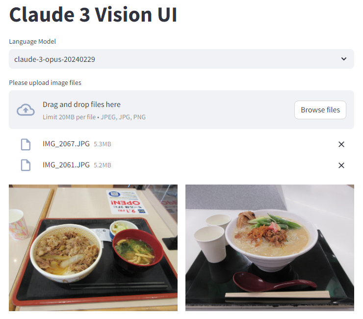
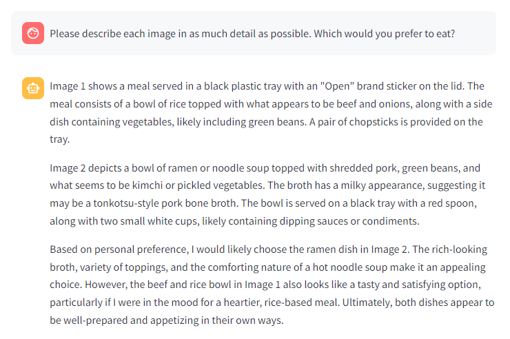
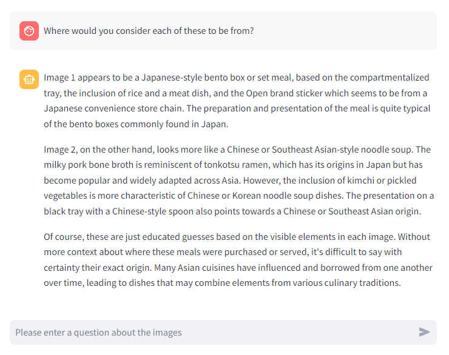

# claude-vision-ui

Simple Web UI to try out Claude 3 Vision.

# Setup

An example of the setup procedure is shown below.

```
$ git clone https://github.com/sh2/claude-vision-ui.git
$ cd claude-vision-ui/src
$ python3 -m venv .venv
$ source .venv/bin/activate
$ pip install -r requirements.txt
$ cd ..
$ cp template_script.sh script.sh
$ vim script.sh
$ ./script.sh
```

# Usage

First, select a language model.
Next, upload your image files.
The format is JPEG or PNG, and each file can be up to 20 MB.
Large images will be automatically scaled down.
You may upload multiple files.



Then ask a question about the image,
Claude 3 will then return a message.



You can also ask additional questions.


